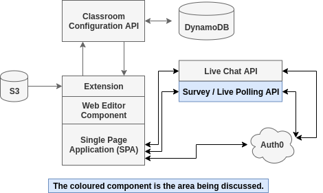

# Morum OSS - Live Survey Polling

## Description

Conducting surveys and live polling the classroom are excellent techniques for measuring understanding and teaching effectiveness.

## Notable Feature Requirements

1.	**Asynchronous, Concurrent Functionality**
    1.	This is a live chat system, we should avoid any blocking behaviors in this application.
    2.	We also need to support web sockets, essentially after a TCP connection is made, the visual interface continuously receives messages instead of polling the API for changes.
2.	**Authentication (You can add this functionality later, if you wish)**
    1.	We are using Auth0 for authentication and as a result, you can assume this API will receive a JWT token in the initial request header, which the API will then use to validate the user.
3.	**One Vote per User**
    1.	There should be a limit to how many messages can be sent per second.
4.	**Memory**
    1.	This instance will be created for a specific classroom on-the-fly. We don’t need to use a message queue or external service at this point in time. You can keep the votes in-memory, but have a separate endpoint to retrieve the data.

## Capstone Requirements

1.	**Visual Interface**
a.	The capstone requires a back-end and front-end. You’re welcome to create whatever visual interface you feel is appropriate.
 
